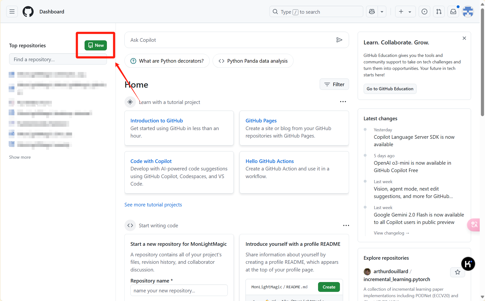

> Final update in: 2025/02/12

第一次写博客，记录一下自己的个人主页。

先讲一下主页的结构，在GitHub上建立了个人主页，然后买了一个域名解析到自己的GitHub就可以了，接下来是具体的细节。

### 建立GitHub个人主页

首先进入到你的[GitHub](https://github.com/)中（需要你已经注册了账号，如果还没注册的话网上有很多的教程，此处不再赘述），新建一个项目



需要注意的是，这个项目的名字一定要是【你的GitHub用户名.github.io】，比如我的GitHub名字叫“name111”，那我的项目的名称就应该是“name111.github.io"。接着创建完之后有如下界面。（对于新手不熟悉git操作的话，强烈推荐GitHub的desktop，可以帮你免去很多git指令，很方便）


接着在这个仓库里上传md或者html文件就好了，注意第一个文件命名为index.html或index.md

此处以html为例，那么你的index.html就应该是

```html
<html>
    <h1>
        Hello Github
    </h1>
</html>
```

然后会有下图的效果。好了，网站已经创建完成了，接下来就是前端美化的任务了，可以按照你的想法去完善你的个人主页了。


### 修改域名

如果你已经完成了上述内容，那么你的主页的域名就应该是”GitHub用户名.github.io"。但是用这个域名来介绍自己的时候可能还不太令你满意，如何购买一个自己喜欢的域名并指向自己的网页呢，接着往下看吧。

有很多购买域名的企业，比如[阿里云](https://wanwang.aliyun.com/domain)，[华为云](https://www.huaweicloud.com/product/domain.html)，登录网站，实名认证之后选择一个自己喜欢的域名


在红框里输入自己想要的域名，选择一个合适的后缀，如果没有人注册过，那就可以归你了。


购买了合适的域名之后，华为会先进行人工审核（一般是几个小时），通过后按照华为云的教程将DNS修改为华为DNS，然后新建一个解析


最后一步！在GitHub的个人主页的仓库里添加一个文件CNAME文件，注意没有后缀，在里面写上你的域名，就大功告成了！快去试试吧

---

欢迎和我交流，通过邮件、微信、GitHub都可以

