# 毕设进度

[多种任务](http://zhangyuyang.top/blogs/multi-task)                                           [编码器](http://zhangyuyang.top/blogs/encoder)                                   [动态特征选择模块](http://zhangyuyang.top/blogs/FSM)                                                      [解码器](http://zhangyuyang.top/blogs/decoder)

无FSM模块

​                                                                                 		     

​												*下图标题应是vqa，此处写错了*

---

**有FSM模块**

----

---

---

---

---

# 论文分享

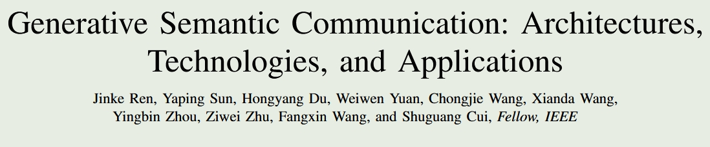

3GAI+SC**+**LLM native SC

> GAI：生成式AI，核心思想是从学习从隐空间到可观测空间的规律
>
> SC：语义通信场景：**时间敏感（VR即时通信）**或**数据量大（交通监控）**

## INTRODUCTION

语义通信现存的问题：

1）泛化能力有限，一套系统一般只能解决一个任务；

2）鲁棒性低，训练环境单一；

3）推理能力不足，缺乏足够的背景知识。

GAI应用于SC系统的两点优势：通过自我监督机制，可以利用未标注数据进行学习，以提高泛化性能；强大的网络可以有效捕获语义信息。

## TRADITIONAL SEMCOM EMPOWERED BY GAI  MODELS

### A VAE-enabled SC

VAE（变分自编码器）其先压缩后重建的思想和语义通信相契合。

从AE到VAE的目的（从过拟合到正确拟合）

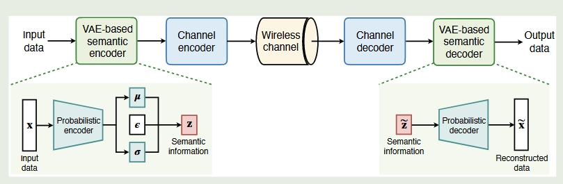

典型的VAE架构的语义通信系统如图所示

在transmitter，VAE提取向量特征进行压缩，在receiver，VAE将向量重建回高维。VAE的工作有很多，比较有代表性的是结合DRL和语义码本来做语义通信。也有变种VAE，但是感觉大部分工作都是来做编码或者codebook的，例如VQ-VAE

### B GAN-enabled SemCom

GAN是生成式对抗网络，主要有编码器和判别器组成。这种“进化军备竞赛”模式也给SC提供了新的方法。

*VAE是学习可观测空间到隐空间的分布规律，而GAN是直接再引入一个神经网络，用这个神经网络来做判别（或者叫度量），但是两者的共同目的都是掌握隐空间到可观测空间的分别规律*

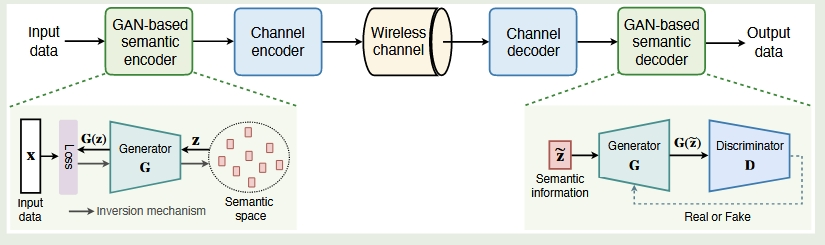

基于GAN的语义通信系统

*语义缓存模块，看起来也可以作为一个创新点，用的人应该不是很多*

用GAN的创新主要在于对编解码器的修改，是做生成式AI和语义通信编解码器方向的热点问题，后面写综述可以重点参考。

### C DM-enabled SemCom

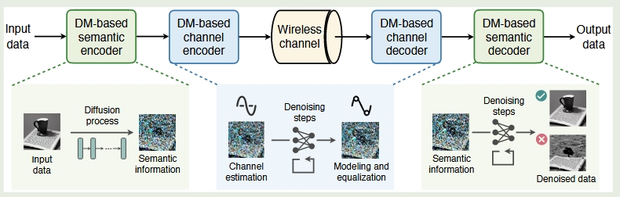

基于DM的语义通信系统

DM的优势在于信道部分，即使发送的图片收到了信道的噪声影响，但是仍然可以训练解码器进行恢复。

DM是一个非常有潜力的模型，可以在其基础上开展多模态、信道估计以及安全方面的研究

## LLM-DRIVEN GENERATIVE SEMCOM

提出了LLM原生SC框架

LLM和语义通信结合的两个方法LLM直接编码和LLM作为工具的辅助编码

LLM已经被用于执行语义编码，使用bert作为编码器的较多。但是更多的是用大模型来作为知识库。

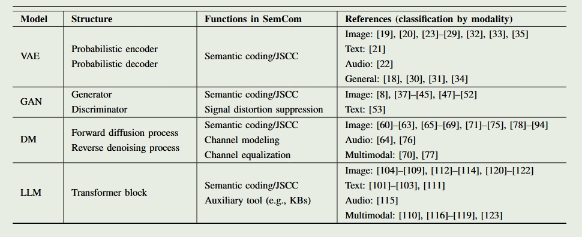

这是四种不同生成模型与SC的整理

LLM应用于语义通信系统的局限性：1）LLM难以胜任其他模态；2）LLM是为NLP定制的，应用于SM可能会受到信道等影响，需要微调；3）大多数研究仍以传统思维进行设计，难以发挥LLM的生成能力，要从生成式的角度建立新的范式；4）缺乏统一框架指导

本文所提出的LLM原生SC框架的优点：1）多模态数据投影到语言空间；2）引入轻量级微调模块，既对LLM微调又不占用太多计算资源；3）采用LLM+AI的形式，LLM用于内容生成，AI用于消除幻觉；4）开发了新框架用于LLM和SC集成

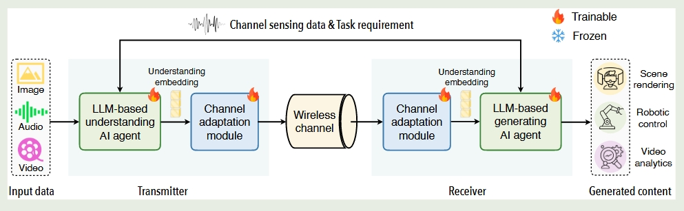

拟议的LLM原生SC系统框架

两端的AI智能体分别称为理解AI智能体和生成AI智能体，都包括五个部分：感知编码器、数据驱动的 LLM 适应、内存系统、工具集成和功能头

---

**感知编码器**

感知编码器的输入是多模态数据、通道信息、任务要求。为实现多模态数据投影到统一空间，要选用精心设计的编码器，例如ViT、C-former（用于语音模态）或最近提出的多模态编码器ImageBind和 SBER-MoVQGAN5

**数据驱动的LLM适应（data-driven LLM adaptation）**

由预训练的LLM和微调模块组成，为LLM添加SC领域知识。数据驱动的LLM适应的目标是有角色提示词（role prompt）决定的，可以令其扮演某领域的专家来理解输入内容并做出准确描述；而在接收端则可以令其根据输入信息生成内容以满足任务要求

*感觉像是用LLM对资料进行整理，可能成为瓶颈*

**记忆系统**

类似于KM知识库的存在，分为短期记忆和长期记忆。短期记忆就是LLM的上下文，长期记忆可以利用知识图谱等结构存储。

*此处可以和另一篇论文的长上下文LLM MEC一起考虑，应该也会成为时间瓶颈*

**工具集成**

此处放置API供大模型调用。对于某些专业领域，LLM可以调用其领域的应用程序的API，从而减少大模型的幻觉和错误。

**功能头**

用于处理LLM的输出特征，理解AI智能体用于提取输入数据的核心语义，生成AI智能体则结合任务来生成内容，此处可以根据不同的任务来定制不同的模型。

---

采用GAI作为信道编码器

*感觉这篇文章的综述部分内容还不错，讲解了模型以及在SC系统中的作用，但是所提出的LLM原生SC有点过于大了，计算反而成了主要时间，通信被弱化了，不是很实用。但是其LLM的每个模块可以用于后续的研究，所提出的SC哪一部分有欠缺再只加上一个模块而不是全要*

## A CASE STUDY OF LLM-NATIVE GENERATIVE  SEMCOM

任务要求：发送方有一个超大视频，而接收方只需要视频中感兴趣的人或车辆的剪辑片段，该场景普遍存在于交通领域、安全监控等

实现：

对于感知编码器，采用YOLOv8对图像中的所有对象进行跟踪并提取关键帧。且配备了多模态LLM InterVL-1.5用于处理关键字并生成描述性条目。

对于数据驱动的LLM适应，给定如下提示词

而在接收端也部署了LLM QWen，用于根据接收到的条目生成关键帧的完整描述，其提示词如下：

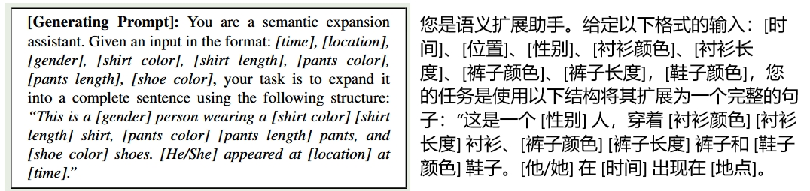

对于功能头，接收方采用 MiniLM-L6-v2 模型来生成检索结果。根据QWen的输出判断关键帧中是否存在目标对象。

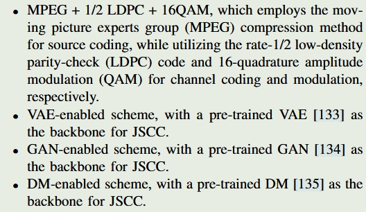

四种基线传输方案

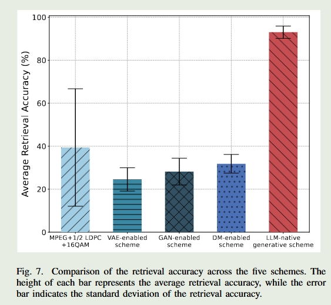

平均检索精度

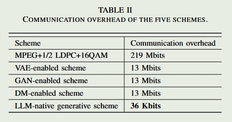

通信开销

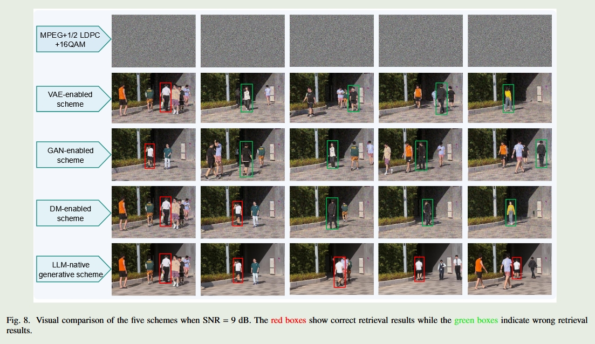

任务：检测白上衣、黑裤子、黑鞋子的男人的结果，红框表示正确，绿框表示错误。由于是低信噪比，传统通信无法传输图像。

*通过实验结果，对于时间不敏感且算力足够，有大量数据要传输的通信场景，可以适当选用LLM的SC系统*

## PROMISING APPLICATIONS OF GENERATIVE SEMCOM

生成式语义通信潜在应用方向：工业物联网、V2X，元宇宙和低空经济

工业物联网中要传输的数据很多；V2X要进行低时延通信（感觉此处不太适合此SC系统）；元宇宙场景有大量数据要进行传输，且一定程度上要保护用户的隐私，并且元宇宙要进行大量的AI辅助构建场景，和本文所提框架有相似之处；低空经济需要低延迟和抗干扰信息。

## OPEN ISSUES AND FUTURE DIRECTIONS

后续的研究方向

边缘设备如何部署LLM？

信道变化可能会对部署的AI智能体产生不良影响，解决方法：改进知识库或用持续学习学习信道变化对AI智能体进行改进；

潜在隐私和安全问题，LLM可能会将隐私内容编码到信息里然后发射，但可能会存在窃听者窃取信息，需要研究先进的编码技术或隐私保护技术。

---

---

---

---

---

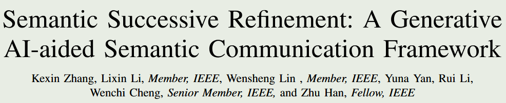

看起来主要目标在于提升语义系统的感知能力，实验做了很多，并且有瑞利信道。

## Introduction

随着AI的技术发展，尤其是大量的移动设备的出现，是的AIGC公司尽可能的为网络边缘设备提供高质量的AGI服务

文章主要有四个创新点或贡献

1.提出了GSC（GAI semantic communication）框架。发送方用swin transformer编码，接收方用diffusion解码

2.拓展了多用户场景，设计了异步并发处理等面向多用户的方法

3.对diffusion进行了改进。利用扩散模型强大的分布映射能力，通过估计一个紧凑的条件向量来指导解码端的语义恢复

4.在公共数据集上进行了测试，有着较好的效果

*看一下swin transformer和vi transformer*

文章最大的创新点是和一般的语义通信系统架构不同，其在最后添加了语义信息强化模块，也就是说去结构是：语义编码器-信道-语义解码器-语义微调。其编解码器部分采用的是Swin transformer（本架构仅适用于图像传输），语义微调模块采用diffusion

## Related works

ISC（image SC）主要分为面向语义和面向任务两个方向，面向语义重点关注图片重建任务，面向任务重点关注根据不同任务发送不同长度或质量的消息。本文提到了很多的论文，后面可以回来看一下。

> 如果想接续做ISC这个方向，可以以本文为出发点

介绍的相关工作挺全面的，尤其是GAI和语义通信结合的领域也有不少论文，后续真的可以以此为抓手整理综述文章

## Proposed Model

系统主要由四部分组成，分别是语义编码模块、无线物理信道、语义解码模块、语义微调模块

### A Semantic feature encoder module

> Swin Transformer（Shift Windows Transformer——基于移位窗口的transformer）
>
> 对于stage1，首先将图像划分为4*4的小块（ Patch 拆分模块 (Patch Partition)），然后从左上角到右下角排列，最后展平（即提升维度），然后每个小块放入到transformer中作为token输入。可以用$(\frac{H}{4},\frac{W}{4},C)$可以理解成总共有$\frac{H}{4}\times\frac{W}{4}$个小块，每个小块被展平成了C维度。
>
> 对于stage2，首先是补丁拼接层，他将临近的2*2的小图像合并成一个，那么就会有$\frac{H}{8}\times\frac{W}{8}$个小块（或称，分辨率为$\frac{H}{8}\times\frac{W}{8}$，）同时其维度变为了4倍，可以用$(\frac{H}{8},\frac{W}{8},4C)$表示。为了降低维度（下采样），将进行全连接操作，将维度从4C降低到2C
>
> 一个stage1和若干个stage2组成Swin Transformer，其分辨率逐渐从$(\frac{H}{4},\frac{W}{4},C)$变为$(\frac{H}{8},\frac{W}{8},C)$，$(\frac{H}{16},\frac{W}{16},C)$······
>
> 对于注意力机制，两个swin transformer layer为一个整体，分别是W-MSA（基于窗口的多头自注意力机制）和SW-MSA（基于移动窗口的多头自注意力机制），W-MSA主要提取一个窗口内的attention分数，而SW-MSA主要先对图像进行位置变换，然后提取一个窗口含有之前不同窗口的信息，再对这个新窗口提取attention分数。具体的解释可以看[这篇知乎](https://zhuanlan.zhihu.com/p/648622267)，讲的很清楚

文章中的encoder不仅包括所谓的语义编码器，还包括信道编码器。

本文所提架构的语义编码器就是Swin transformer，且由于硬件条件限制，paper只设置了两层的layer，在实际应用中，越大的图片应该层数越多。而信道编码器，则是根据噪声提前给定了固定的映射方式，将语义编码输出为复杂比特流（矢量）。

### B Physical wireless channel module

选定了衰落信道

### C Semantic feature decoder module

解码器也是首先由信道解码器解码为比特流，接着送到语义解码器。语义解码器在文章中也只是简单叙述，没有具体描述其结构，然后水篇幅介绍了一下MSE。

### D Semantic fine-tuning module

语义微调模块主要分为两个关键部分：训练过程和测试过程，分别在云端和本地进行。

训练部分有两个主要网络，分别是先验提取网络（N1）和图片降噪网络（N2）

N1,N2联合优化。在训练过程中，首先拼接发送的原始图片和语义恢复的图片，然后经过PixelUnshuffle采样，再由N1网络生成先验描述（PRs）Z，然后在N2网络中，再由DMTA和DGFN组成的动态transformer中，为Z添加细节，得到增强语义图像。训练过程中N1和N2联合优化，loss采用L1范式。

而diffusion model则是应用于N1和N2之间，主要是将Z扩散生成$\hat{Z}$送到N2.

在测试阶段，则是用训练好的N1模型，不送原始图像只送接收到的图像来生成Z，测试阶段用D表示，然后再由DM生成$\hat{D}$再送到N2中

### E Multi-user communication system

多用户的GSC也比较水。在预处理阶段实施了数据分割策略。这种方法模拟不同的用户源生成不同的消息，从而能够将用户任务有效地分配给各种处理单元，并允许这些任务并发执行。理解起来就是模拟不同用户然后学习，然后用这个模型去分割。在此之前是接收机是收到所有用户数据不作分别的。看起来像凑创新点的

## SIMULATION RESULTS AND DISCUSSIONS

从实验结果来看，PSNR指标下效果比DeepJSCC要好，尤其是在低信噪比下微调模块发挥着重要作用。

## Conclusion

未来的研究将旨在探索更多动态、上下文感知的解决方案，以在日益复杂和多变的环境中优化模型适应性和性能。
