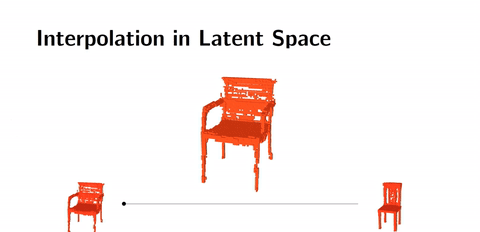
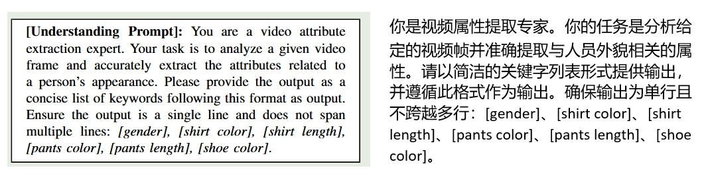

# 毕设进度

[多种任务](http://zhangyuyang.top/blogs/multi-task)                                           [编码器](http://zhangyuyang.top/blogs/encoder)                                   [动态特征选择模块](http://zhangyuyang.top/blogs/FSM)                                                      [解码器](http://zhangyuyang.top/blogs/decoder)

无FSM模块

​                                                                                 		     

​												*下图标题应是vqa，此处写错了*

---

**有FSM模块**

----

---

---

---

---

# 论文分享

3GAI+SC**+**LLM native SC

> GAI：生成式AI，核心思想是从学习从隐空间到可观测空间的规律
>
> SC：语义通信场景：**时间敏感（VR即时通信）**或**数据量大（交通监控）**

## INTRODUCTION

语义通信现存的问题：

1）泛化能力有限，一套系统一般只能解决一个任务；

2）鲁棒性低，训练环境单一；

3）推理能力不足，缺乏足够的背景知识。

GAI应用于SC系统的两点优势：通过自我监督机制，可以利用未标注数据进行学习，以提高泛化性能；强大的网络可以有效捕获语义信息。

## TRADITIONAL SEMCOM EMPOWERED BY GAI  MODELS

### A VAE-enabled SC

VAE（变分自编码器）其先压缩后重建的思想和语义通信相契合。

从AE到VAE的目的（从过拟合到正确拟合）

典型的VAE架构的语义通信系统如图所示

在transmitter，VAE提取向量特征进行压缩，在receiver，VAE将向量重建回高维。VAE的工作有很多，比较有代表性的是结合DRL和语义码本来做语义通信。也有变种VAE，但是感觉大部分工作都是来做编码或者codebook的，例如VQ-VAE

### B GAN-enabled SemCom

GAN是生成式对抗网络，主要有编码器和判别器组成。这种“进化军备竞赛”模式也给SC提供了新的方法。

*VAE是学习可观测空间到隐空间的分布规律，而GAN是直接再引入一个神经网络，用这个神经网络来做判别（或者叫度量），但是两者的共同目的都是掌握隐空间到可观测空间的分别规律*

基于GAN的语义通信系统

*语义缓存模块，看起来也可以作为一个创新点，用的人应该不是很多*

用GAN的创新主要在于对编解码器的修改，是做生成式AI和语义通信编解码器方向的热点问题，后面写综述可以重点参考。

### C DM-enabled SemCom

基于DM的语义通信系统

DM的优势在于信道部分，即使发送的图片收到了信道的噪声影响，但是仍然可以训练解码器进行恢复。

DM是一个非常有潜力的模型，可以在其基础上开展多模态、信道估计以及安全方面的研究

## LLM-DRIVEN GENERATIVE SEMCOM

提出了LLM原生SC框架

LLM和语义通信结合的两个方法LLM直接编码和LLM作为工具的辅助编码

LLM已经被用于执行语义编码，使用bert作为编码器的较多。但是更多的是用大模型来作为知识库。

这是四种不同生成模型与SC的整理

LLM应用于语义通信系统的局限性：1）LLM难以胜任其他模态；2）LLM是为NLP定制的，应用于SM可能会受到信道等影响，需要微调；3）大多数研究仍以传统思维进行设计，难以发挥LLM的生成能力，要从生成式的角度建立新的范式；4）缺乏统一框架指导

本文所提出的LLM原生SC框架的优点：1）多模态数据投影到语言空间；2）引入轻量级微调模块，既对LLM微调又不占用太多计算资源；3）采用LLM+AI的形式，LLM用于内容生成，AI用于消除幻觉；4）开发了新框架用于LLM和SC集成

拟议的LLM原生SC系统框架

两端的AI智能体分别称为理解AI智能体和生成AI智能体，都包括五个部分：感知编码器、数据驱动的 LLM 适应、内存系统、工具集成和功能头

---

**感知编码器**

感知编码器的输入是多模态数据、通道信息、任务要求。为实现多模态数据投影到统一空间，要选用精心设计的编码器，例如ViT、C-former（用于语音模态）或最近提出的多模态编码器ImageBind和 SBER-MoVQGAN5

**数据驱动的LLM适应（data-driven LLM adaptation）**

由预训练的LLM和微调模块组成，为LLM添加SC领域知识。数据驱动的LLM适应的目标是有角色提示词（role prompt）决定的，可以令其扮演某领域的专家来理解输入内容并做出准确描述；而在接收端则可以令其根据输入信息生成内容以满足任务要求

*感觉像是用LLM对资料进行整理，可能成为瓶颈*

**记忆系统**

类似于KM知识库的存在，分为短期记忆和长期记忆。短期记忆就是LLM的上下文，长期记忆可以利用知识图谱等结构存储。

*此处可以和另一篇论文的长上下文LLM MEC一起考虑，应该也会成为时间瓶颈*

**工具集成**

此处放置API供大模型调用。对于某些专业领域，LLM可以调用其领域的应用程序的API，从而减少大模型的幻觉和错误。

**功能头**

用于处理LLM的输出特征，理解AI智能体用于提取输入数据的核心语义，生成AI智能体则结合任务来生成内容，此处可以根据不同的任务来定制不同的模型。

---

采用GAI作为信道编码器

## A CASE STUDY OF LLM-NATIVE GENERATIVE  SEMCOM

任务要求：发送方有一个超大视频，而接收方只需要视频中感兴趣的人或车辆的剪辑片段，该场景普遍存在于交通领域、安全监控等

实现：

对于感知编码器，采用YOLOv8对图像中的所有对象进行跟踪并提取关键帧。且配备了多模态LLM InterVL-1.5用于处理关键字并生成描述性条目。

对于数据驱动的LLM适应，给定如下提示词

而在接收端也部署了LLM QWen，用于根据接收到的条目生成关键帧的完整描述，其提示词如下：

对于功能头，接收方采用 MiniLM-L6-v2 模型来生成检索结果。根据QWen的输出判断关键帧中是否存在目标对象。

四种基线传输方案

平均检索精度

通信开销

任务：检测白上衣、黑裤子、黑鞋子的男人的结果，红框表示正确，绿框表示错误。由于是低信噪比，传统通信无法传输图像。

*通过实验结果，对于时间不敏感且算力足够，有大量数据要传输的通信场景，可以适当选用LLM的SC系统*

## PROMISING APPLICATIONS OF GENERATIVE SEMCOM

生成式语义通信潜在应用方向：工业物联网、V2X，元宇宙和低空经济

工业物联网中要传输的数据很多；V2X要进行低时延通信（感觉此处不太适合此SC系统）；元宇宙场景有大量数据要进行传输，且一定程度上要保护用户的隐私，并且元宇宙要进行大量的AI辅助构建场景，和本文所提框架有相似之处；低空经济需要低延迟和抗干扰信息。

## OPEN ISSUES AND FUTURE DIRECTIONS

后续的研究方向

边缘设备如何部署LLM？

信道变化可能会对部署的AI智能体产生不良影响，解决方法：改进知识库或用持续学习学习信道变化对AI智能体进行改进；

潜在隐私和安全问题，LLM可能会将隐私内容编码到信息里然后发射，但可能会存在窃听者窃取信息，需要研究先进的编码技术或隐私保护技术。

---

---

---

---

---

看起来主要目标在于提升语义系统的感知能力，实验做了很多，并且有瑞利信道。

## Introduction

随着AI的技术发展，尤其是大量的移动设备的出现，是的AIGC公司尽可能的为网络边缘设备提供高质量的AGI服务

文章主要有四个创新点或贡献

1.提出了GSC（GAI semantic communication）框架。发送方用swin transformer编码，接收方用diffusion解码

2.拓展了多用户场景，设计了异步并发处理等面向多用户的方法

3.对diffusion进行了改进。利用扩散模型强大的分布映射能力，通过估计一个紧凑的条件向量来指导解码端的语义恢复

4.在公共数据集上进行了测试，有着较好的效果

*看一下swin transformer和vi transformer*

文章最大的创新点是和一般的语义通信系统架构不同，其在最后添加了语义信息强化模块，也就是说去结构是：语义编码器-信道-语义解码器-语义微调。其编解码器部分采用的是Swin transformer（本架构仅适用于图像传输），语义微调模块采用diffusion

## Related works

ISC（image SC）主要分为面向语义和面向任务两个方向，面向语义重点关注图片重建任务，面向任务重点关注根据不同任务发送不同长度或质量的消息。本文提到了很多的论文，后面可以回来看一下。

> 如果想接续做ISC这个方向，可以以本文为出发点

介绍的相关工作挺全面的，尤其是GAI和语义通信结合的领域也有不少论文，后续真的可以以此为抓手整理综述文章

## Proposed Model

系统主要由四部分组成，分别是语义编码模块、无线物理信道、语义解码模块、语义微调模块

### A Semantic feature encoder module

> Swin Transformer（Shift Windows Transformer——基于移位窗口的transformer）
>
> 对于stage1，首先将图像划分为4*4的小块（ Patch 拆分模块 (Patch Partition)），然后从左上角到右下角排列，最后展平（即提升维度），然后每个小块放入到transformer中作为token输入。可以用$(\frac{H}{4},\frac{W}{4},C)$可以理解成总共有$\frac{H}{4}\times\frac{W}{4}$个小块，每个小块被展平成了C维度。
>
> 对于stage2，首先是补丁拼接层，他将临近的2*2的小图像合并成一个，那么就会有$\frac{H}{8}\times\frac{W}{8}$个小块（或称，分辨率为$\frac{H}{8}\times\frac{W}{8}$，）同时其维度变为了4倍，可以用$(\frac{H}{8},\frac{W}{8},4C)$表示。为了降低维度（下采样），将进行全连接操作，将维度从4C降低到2C
>
> 一个stage1和若干个stage2组成Swin Transformer，其分辨率逐渐从$(\frac{H}{4},\frac{W}{4},C)$变为$(\frac{H}{8},\frac{W}{8},C)$，$(\frac{H}{16},\frac{W}{16},C)$······
>
> 对于注意力机制，两个swin transformer layer为一个整体，分别是W-MSA（基于窗口的多头自注意力机制）和SW-MSA（基于移动窗口的多头自注意力机制），W-MSA主要提取一个窗口内的attention分数，而SW-MSA主要先对图像进行位置变换，然后提取一个窗口含有之前不同窗口的信息，再对这个新窗口提取attention分数。具体的解释可以看[这篇知乎](https://zhuanlan.zhihu.com/p/648622267)，讲的很清楚

文章中的encoder不仅包括所谓的语义编码器，还包括信道编码器。

本文所提架构的语义编码器就是Swin transformer，且由于硬件条件限制，paper只设置了两层的layer，在实际应用中，越大的图片应该层数越多。而信道编码器，则是根据噪声提前给定了固定的映射方式，将语义编码输出为复杂比特流（矢量）。

### B Physical wireless channel module

选定了衰落信道

### C Semantic feature decoder module

解码器也是首先由信道解码器解码为比特流，接着送到语义解码器。语义解码器在文章中也只是简单叙述，没有具体描述其结构，然后水篇幅介绍了一下MSE。

### D Semantic fine-tuning module

语义微调模块主要分为两个关键部分：训练过程和测试过程，分别在云端和本地进行。

训练部分有两个主要网络，分别是先验提取网络（N1）和图片降噪网络（N2）

N1,N2联合优化。在训练过程中，首先拼接发送的原始图片和语义恢复的图片，然后经过PixelUnshuffle采样，再由N1网络生成先验描述（PRs）Z，然后在N2网络中，再由DMTA和DGFN组成的动态transformer中，为Z添加细节，得到增强语义图像。训练过程中N1和N2联合优化，loss采用L1范式。

而diffusion model则是应用于N1和N2之间，主要是将Z扩散生成$\hat{Z}$送到N2.

在测试阶段，则是用训练好的N1模型，不送原始图像只送接收到的图像来生成Z，测试阶段用D表示，然后再由DM生成$\hat{D}$再送到N2中

### E Multi-user communication system

多用户的GSC也比较水。在预处理阶段实施了数据分割策略。这种方法模拟不同的用户源生成不同的消息，从而能够将用户任务有效地分配给各种处理单元，并允许这些任务并发执行。理解起来就是模拟不同用户然后学习，然后用这个模型去分割。在此之前是接收机是收到所有用户数据不作分别的。看起来像凑创新点的

## SIMULATION RESULTS AND DISCUSSIONS

从实验结果来看，PSNR指标下效果比DeepJSCC要好，尤其是在低信噪比下微调模块发挥着重要作用。

## Conclusion

未来的研究将旨在探索更多动态、上下文感知的解决方案，以在日益复杂和多变的环境中优化模型适应性和性能。

---

---

---

语义通信的实现主要注重两个问题：语言设计和语义理解

语言设计重点关注语义语言规范，或码本定义等问题，在于收发双方如何去定义一种新语言，类似与传统通信的01码流，不同二进制的数表示不同的字。常用DL去解决，同时对于联合信源编码（JSCC）的研究更多一些

语义理解是语义通信的重点，在于收发双方约定好统一的语言之后，如何消除语言歧义，如何对相同的文字又相同的理解，从而可以传达信息

## 第三部分 问题制定

**语义信息熵**被定义为

---

有**语义语言四元组**

WSPQ分别对应于word, syntax, expression, and interpretation（词，语法，表达方式和理解）

词在语法的指导下组成了句子，全部的句子用S来表示，句子的含义用W来表示。P（表达方式）意为表述一种意思的全部句子；Q（理解）意为一个句子的全部含义。

---

对于**语义信道部分**

有如下公式

解释这个公式首先要明确传统信道的内容{c(sˆ|s) ∈ [0, 1] : s, sˆ ∈  S, ∑  sˆ c(sˆ|s) = 1}，也就是对于原始信息s，接收方收到了$\hat{s}$的概率转移矩阵。而对于Pr($\hat{w}$|w)则可以理解为要在传统信道转移矩阵的基础上乘上对于语义w的表达方法概率和对于收到的句子$\hat{s}$的理解的概率。

***

对于**语义编码方案**

可以视为一个meaning到message的映射

---

对于**语义失真度（encoder）**

有w和$\hat{w}$，有语义失真度d(w,$\hat{w}$)，其形式为一个矩阵。而对于一套语义编码方案的平均语义失真度为

---

对于**语义成本**

定义成本函数$l(s) : S \rightarrow {IR}^+,\forall s\in S$，其形式为一个矩阵。而对于一套语义编码方案的平均语义成本为

---

对于解码端，仍然有语义失真度这个概念。对于**语义失真度（decoder）**

首先定义语义解码，其是message到meaning的映射

其语义失真度为。与encoder失真度不同的是，其解码部分换掉了encoder失真度的q，而encoder失真度的编码部分同样被p所取代

---

## 第四部分 语义编码

对于**失真代价区域**

其中D是失真率，L是成本。对于八个点有如下定义

由于语义通信中更关注失真率的大小，故上横线表示maxD，下横线表示minD，同时最关注的也是下横线的四个点

---

对于**失真代价函数**

意为在给定的L的条件下，最小的D

---

对于**一个meaning（w）到一个message（s）的失真期望**

，则可以得到对于编码方案的语义失真度

---

==定理1==

一个随机编码方案 U*U* 能够实现某个失真-成本对 (L,D)(*L*,*D*) 的充要条件是，这个对可以通过一组确定性编码方案的时间共享（time sharing）来实现。（time sharing 意为一种策略，通过在不同的时间段使用不同的确定性编码方案，来达到某种平均性能）

这个定理表明1.失真代价区域中的任意一点都可以通过一组确定性的语义编码方案通过时间共享来实现2.失真代价区域是一个凸集。扭曲成本函数D * U，Q ( L )为凸函数。

---

将meaning w的S集合划分为**六个子集**

该定义主要关注同一含义的多种表示，哪种表示具有更好的效果，即低失真度且低成本。

简单来讲，在$\underline{S_W^\prime}$中，可以找到比任意 *s* 成本更低且语义失真更小的信号。在$\underline{S_W^{\prime\prime}}$中可以找到比任意s成本高但是语义失真更小的信号，而$\underline{S_W}$则是他们的并集，意为在语义失真度方面有更好表现的信号。其余上划线子集同理。后续刻画失真-代价区域也只需要考虑$\underline{S_W}$和$\overline{S_W}$即可。

---

==定理2==

描述了语义编码的失真-成本区域（distortion-cost region）的边界结构。它指出，语义编码的失真-成本区域的边界是由一组确定性语义编码方案生成的失真-成本对 ($L_{U^{(t)}}$,$D_{U^{(t)}}$)通过分段线性连接构成的。

可进一步引申为失真-代价边界的顶点可以通过算法2中构造的确定性编码方案来实现。边界上的任何非顶点点都可以通过一个随机编码方案或与两个最近顶点相关的两个确定性编码方案的分时（time sharing）实现。

---

对于**一个message（$\hat{s}$ ）到一个meaning（$\hat{w} $ ）的失真期望**

可以和对于**一个meaning（w）到一个message（s）的失真期望**对比理解

----

## 第五部分 语义解码和CSED

对于**语义解码的失真-成本区域**

由于只考虑decoder时，encoder的P是固定的，所以其代价也是固定的故语义解码的失真代价区域是失真代价空间中的一条垂直线。

---

*此处对于语义编码和解码的一些区别和思考*

*解码器关注解码部分，而对于如何编码是无法做出影响的，故“成本”这个概念对于解码来讲是固定的。编码可能对一个词有多种可能，将最热门的词用最短的编码，以获得更低的编码成本，但是这是解码器所无法影响的，故成本对于解码而言是固定的*

*而对于编码器，其有准确的先验信息，可以找到使得语义失真最小的编码方案。但是对于解码器的接收者，其只能根据收到的信息去猜测transmitter所要传达的含义，故不能确定最小的语义失真解码方案*

*综上所述，编码器有着更强的决定能力，是最需要着重关注的地方*

---

==定理3==

其含义为，语义解码的失真-成本区域是有这些直线构成的

---

==定理4==

定理给出了在不准确先验概率下的最佳解码方案和失真。

---

==定理5==

如果采用汉明失真，那么语义解码达到最优效果的方案时，当且仅当公式30满足

接着给出了其几何解释，先将概率进行了归一化即收到了message$\hat{s}$时，其meaning时w的概率。$\alpha$的概率空间可以在几何解释中构建为一个单位图形。简单起见，取N=3，那么该单位图像就是一个三角形。

故几何解释为对于收到的message$\hat{s}$将三角形划分为了三个四边形，当且仅当$\alpha_p(\hat s)$和$\alpha_q(\hat s)$落在相同区域时，汉明失真为0.

这个定理揭示了语义解码达到最优失真方案是非常苛刻的。

进一步讨论可以得到语言语义解码，在一般条件下，其失真率都会小于语言的原始翻译Q的方案，可以得到如下公式

如果先验信息准确的话，应有恒大于0.即V的效果严格好于Q。但是有时该式也会出现负值，这是因为错误的先验。

*此处进行一个解释，为什么V一般条件下优于Q。其实借助先验知识的是V，而Q则只是语言的原本含义，可以理解为直译，而不理解反问，阴阳怪气等，所以一般条件下V效果更好，但是如果先验是错的，那么就会导致V产生更多误解。*

---

**改良翻译过程**

也就是说，对于一个meaning$\hat{w}$弱于集合中任意其他的meaning，因为对于某些失真函数，语言的解释可能是次优的。在这种情况下，要去掉其映射并将其概率分给其他meaning。而若一个meaning明显由于其他任意meaning，那么可以直接将这个$\hat{s}$与其绑定。

---

对于**CSED框架**

其语义编码方案可以表示为，ξ是一个概率分布，表示每个编码方案的权重。$\underline{U^{(i)}}$和$\overline{U^{(i)}}$这些是确定性的语义编码方案。即编码方案 U是多个确定性编码方案的加权组合。

其语义解码方案可以表示为

失真率和编码成本的计算公式分别为：，

CSED的失真-成本区域为一个点集的凸包

注意到，CSED并不一定是优于单一语义编码或语义解码的。当且仅当CSED发送方和接收方双方策略匹配时，才会有一个较好的接受效果。

----

## 第六部分 语义通信举例

举了一个方格世界的例子，然后计算了三种编解码方式的失真-代价区域。

-----

## 第七部分 后续研究方向

指出的研究方向偏底层，文章研究的主要为链路层。